# skeleton

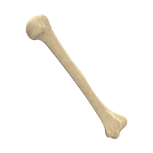Skeleton repo for .NET 10 C# projects using Avalonia

Cross-platform Avalonia app skeleton for .NET C# projects with theming, tabs, search, and reusable setting panels. Includes mock readme (this), scripts, helper, ISCC scripts, version control, resources, VScode & Visual Studio project templates

   

| <h3>General</h3> |
|:---:|
| 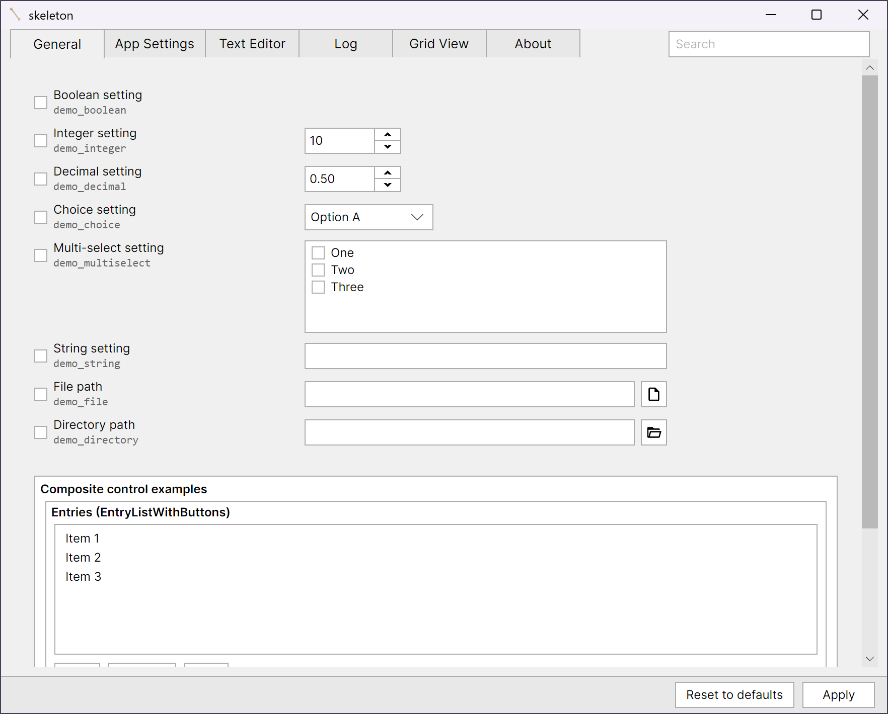 |

## Downloads

<table border="0">
<tbody>
<tr>
<td align="center" valign="top"></td>
<td align="center" valign="top"><a href="https://github.com/fosterbarnes/skeleton/releases/download/v0.2.0/skeletonInstaller_v0.2.0_x86.exe">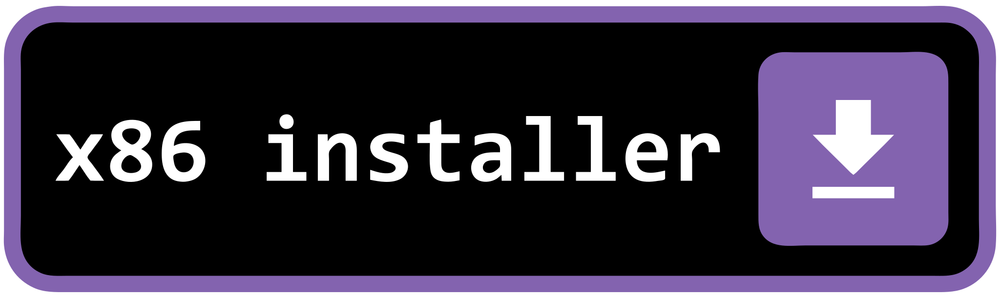</a></td>
<td align="center" valign="top"></td>
</tr>
</tbody>
</table>

<table border="0">
<tbody>
<tr>
<td align="center" valign="top"></td>
<td align="center" valign="top"><a href="https://github.com/fosterbarnes/skeleton/releases/download/v0.2.0/skeletonPortable_v0.2.0_x86.zip">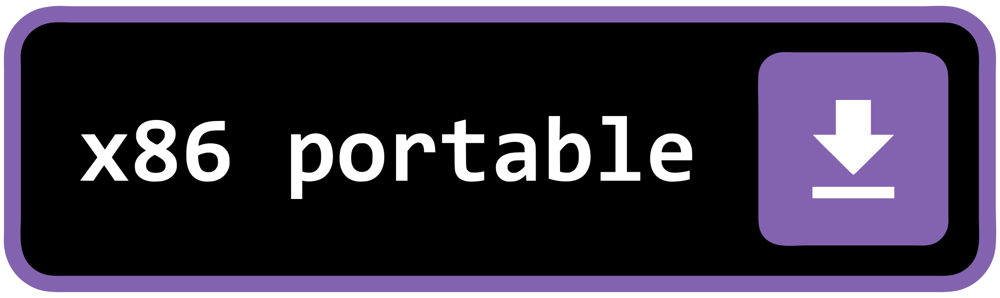</a></td>
<td align="center" valign="top"><a href="https://github.com/fosterbarnes/skeleton/releases/download/v0.2.0/skeletonPortable_v0.2.0_arm64.zip">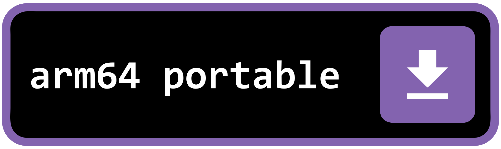</a></td>
</tr>
</tbody>
</table>

## Tabs

[Click to Expand]

| <h3>General</h3> |
|:---:|
|  |

| <h3>App Settings</h3> |
|:---:|
| 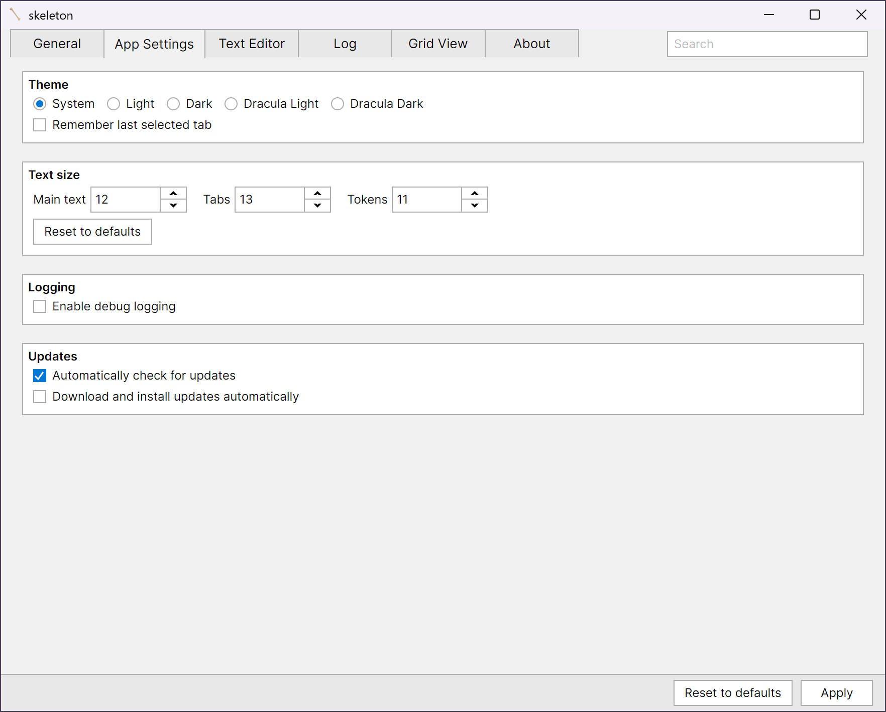 |

| <h3>Text Editor</h3> |
|:---:|
| 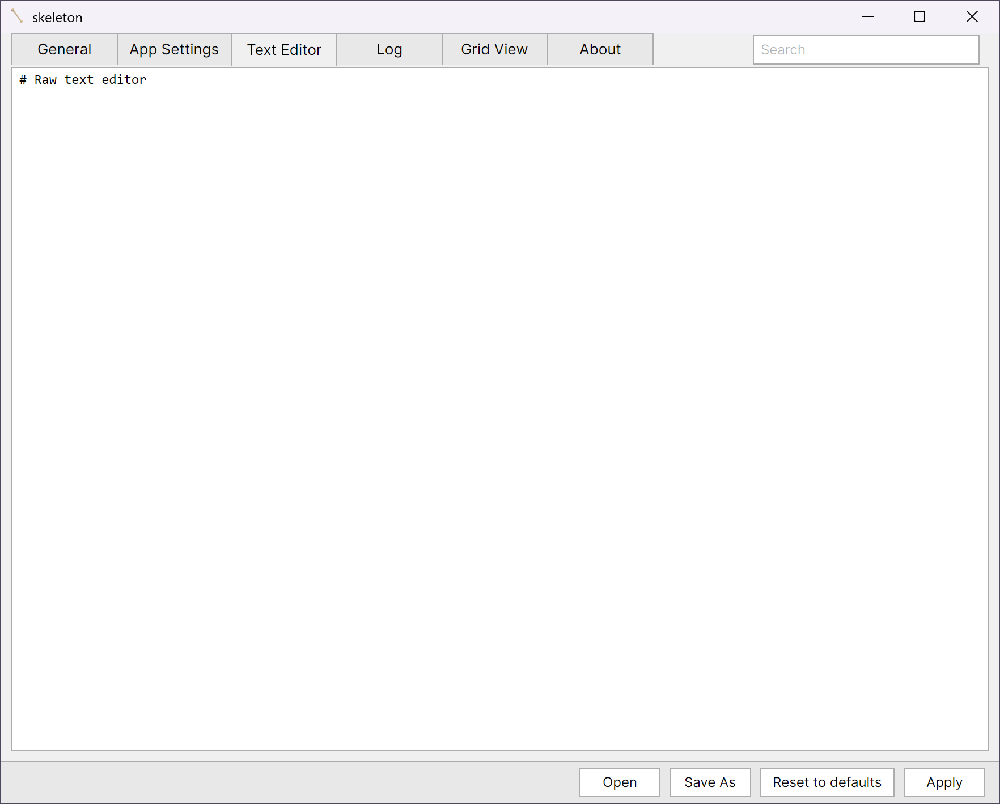 |

| <h3>Log</h3> |
|:---:|
| 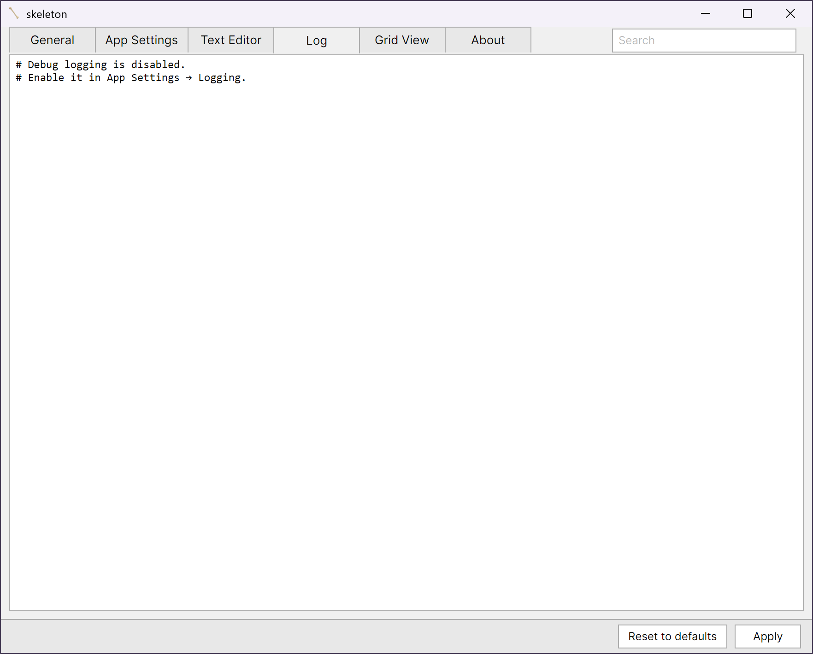 |

| <h3>Grid View</h3> |
|:---:|
| 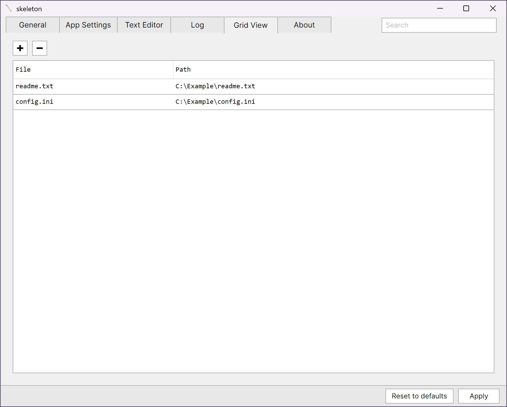 |

| <h3>About</h3> |
|:---:|
| 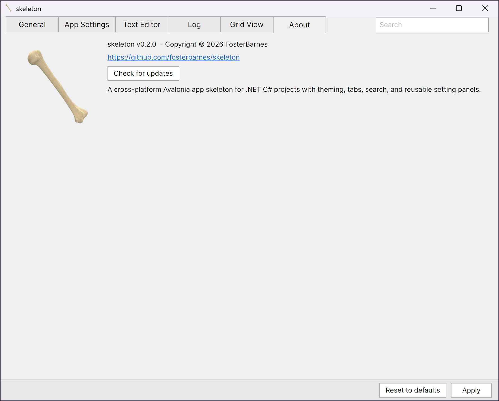 |

## App Themes

[Click to Expand]

| <h3>Light</h3> |
|:---:|
| 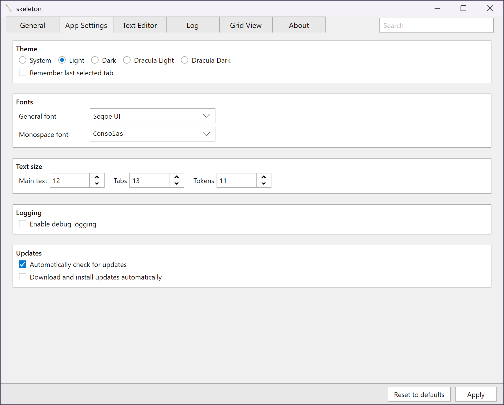 |

| <h3>Dark</h3> |
|:---:|
| 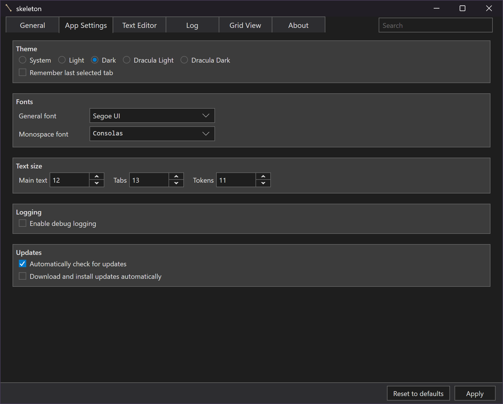 |

| <h3>Dracula Light</h3> |
|:---:|
| 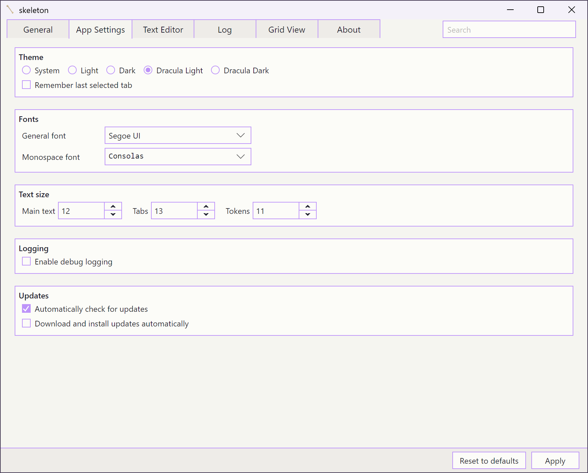 |

| <h3>Dracula Dark</h3> |
|:---:|
| 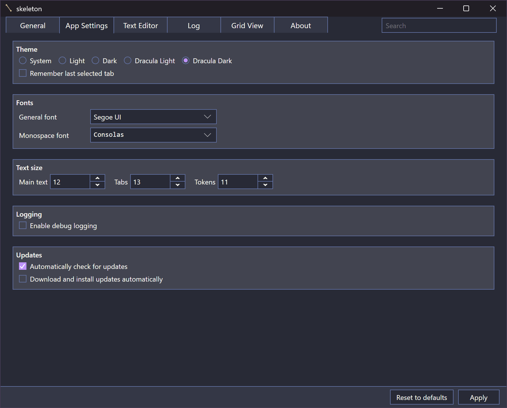 |

## Compatibility

| Platform  | Architecture   | Status |
|------------|-----------------|--------|
| Windows 10 | x86, x64, arm64 | Supported |
| Windows 11 | x86, x64, arm64 | Supported |
| macOS      | x64, arm64      | Planned |
| Linux      | x64, arm64      | Planned |

<!-- Quick Reference --
version = 0.2.0

x64Installer = https://github.com/fosterbarnes/skeleton/releases/download/v0.2.0/skeletonInstaller_v0.2.0_x64.exe

x64Portable = https://github.com/fosterbarnes/skeleton/releases/download/v0.2.0/skeletonPortable_v0.2.0_x64.zip

x86Installer = https://github.com/fosterbarnes/skeleton/releases/download/v0.2.0/skeletonInstaller_v0.2.0_x86.exe

x86Portable = https://github.com/fosterbarnes/skeleton/releases/download/v0.2.0/skeletonPortable_v0.2.0_x86.zip

ARM64Installer = https://github.com/fosterbarnes/skeleton/releases/download/v0.2.0/skeletonInstaller_v0.2.0_arm64.exe

ARM64Portable = https://github.com/fosterbarnes/skeleton/releases/download/v0.2.0/skeletonPortable_v0.2.0_arm64.zip
-->

