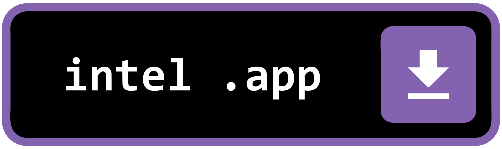
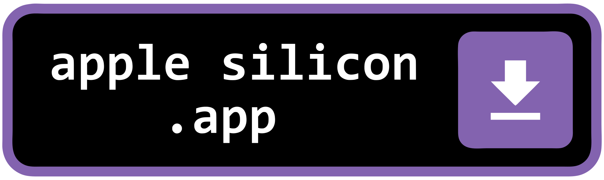

# skeleton

Skeleton repo for .NET 10 C# projects using Avalonia

Cross-platform Avalonia app skeleton for .NET C# projects with theming, tabs, search, and reusable setting panels. Includes mock readme (this), scripts, helper, ISCC scripts, version control, resources, VScode & Visual Studio project templates


<br><br><br>

## Downloads

### Windows

<table border="0">
<tbody>
<tr>
<td align="center" valign="top"><a href="https://github.com/fosterbarnes/skeleton/releases/download/v0.4.2/skeletonInstaller_v0.4.2_x64.exe"></a></td>
<td align="center" valign="top"><a href="https://github.com/fosterbarnes/skeleton/releases/download/v0.4.2/skeletonInstaller_v0.4.2_x86.exe"></a></td>
<td align="center" valign="top"><a href="https://github.com/fosterbarnes/skeleton/releases/download/v0.4.2/skeletonInstaller_v0.4.2_arm64.exe"></a></td>
</tr>
</tbody>
</table>

<table border="0">
<tbody>
<tr>
<td align="center" valign="top"><a href="https://github.com/fosterbarnes/skeleton/releases/download/v0.4.2/skeletonPortable_v0.4.2_x64.zip"></a></td>
<td align="center" valign="top"><a href="https://github.com/fosterbarnes/skeleton/releases/download/v0.4.2/skeletonPortable_v0.4.2_x86.zip"></a></td>
<td align="center" valign="top"><a href="https://github.com/fosterbarnes/skeleton/releases/download/v0.4.2/skeletonPortable_v0.4.2_arm64.zip"></a></td>
</tr>
</tbody>
</table>

### macOS

<table border="0">
<tbody>
<tr>
<td align="center" valign="top"><a href="https://github.com/fosterbarnes/skeleton/releases/download/v0.4.2/skeleton_v0.4.2_macOS-intel.zip"></a></td>
<td align="center" valign="top"><a href="https://github.com/fosterbarnes/skeleton/releases/download/v0.4.2/skeleton_v0.4.2_macOS-arm.zip"></a></td>
</tr>
</tbody>
</table>

### Linux (Debian)

Install the [.NET 10 runtime](https://learn.microsoft.com/en-us/dotnet/core/install/linux-debian) from the Microsoft package repository, then install the matching `.deb` from `publish/` with `apt` (do not run the file directly):

```bash
cd publish
sudo apt install ./skeleton_v0.4.1_debian-amd64.deb
```

Use `-debian-arm64` instead of `-debian-amd64` on arm64 systems.

| Architecture | Download |
|---|---|
| x64 (amd64) | [skeleton_v0.4.1_debian-amd64.deb](https://github.com/fosterbarnes/skeleton/releases/download/v0.4.1/skeleton_v0.4.1_debian-amd64.deb) |
| arm64 | [skeleton_v0.4.1_debian-arm64.deb](https://github.com/fosterbarnes/skeleton/releases/download/v0.4.1/skeleton_v0.4.1_debian-arm64.deb) |

Build on Debian via `./.scripts/.buildAll.ps1` (requires PowerShell 7 and `dpkg-dev` for `dpkg-deb`). In-app updater is not available on Linux in v1.

## Tabs

<details>
<summary>[Click to Expand]</summary>

| <h3>General</h3> |
|:---:|
|  |

| <h3>App Settings</h3> |
|:---:|
|  |

| <h3>Text Editor</h3> |
|:---:|
|  |

| <h3>Log</h3> |
|:---:|
|  |

| <h3>Grid View</h3> |
|:---:|
|  |

| <h3>About</h3> |
|:---:|
|  |

</details>

## App Themes

<details>
<summary>[Click to Expand]</summary>

| <h3>Light</h3> |
|:---:|
|  |

| <h3>Dark</h3> |
|:---:|
|  |

| <h3>Dracula</h3> |
|:---:|
|  |

</details>

## Compatibility

| Platform  | Architecture   | Status |
|------------|-----------------|--------|
| Windows 10 | x86, x64, arm64 | Supported |
| Windows 11 | x86, x64, arm64 | Supported |
| macOS      | x64, arm64      | Supported |
| Linux (Debian) | x64, arm64 | Supported |

<!-- Quick Reference --
version = 0.4.2

x64Installer = https://github.com/fosterbarnes/skeleton/releases/download/v0.4.2/skeletonInstaller_v0.4.2_x64.exe

x64Portable = https://github.com/fosterbarnes/skeleton/releases/download/v0.4.2/skeletonPortable_v0.4.2_x64.zip

x86Installer = https://github.com/fosterbarnes/skeleton/releases/download/v0.4.2/skeletonInstaller_v0.4.2_x86.exe

x86Portable = https://github.com/fosterbarnes/skeleton/releases/download/v0.4.2/skeletonPortable_v0.4.2_x86.zip

ARM64Installer = https://github.com/fosterbarnes/skeleton/releases/download/v0.4.2/skeletonInstaller_v0.4.2_arm64.exe

ARM64Portable = https://github.com/fosterbarnes/skeleton/releases/download/v0.4.2/skeletonPortable_v0.4.2_arm64.zip

osxX64Portable = https://github.com/fosterbarnes/skeleton/releases/download/v0.4.2/skeleton_v0.4.2_macOS-intel.zip

osxArm64Portable = https://github.com/fosterbarnes/skeleton/releases/download/v0.4.2/skeleton_v0.4.2_macOS-arm.zip

linuxAmd64Deb = https://github.com/fosterbarnes/skeleton/releases/download/v0.4.2/skeleton_v0.4.2_debian-amd64.deb

linuxArm64Deb = https://github.com/fosterbarnes/skeleton/releases/download/v0.4.2/skeleton_v0.4.2_debian-arm64.deb
-->

